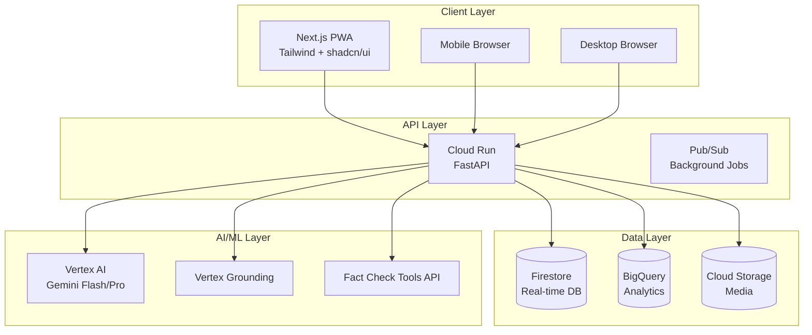

# AI-Powered Misinformation Defense Platform

> **Fast, multilingual, India-first AI companion that flags potentially misleading content, shows evidence with citations, and teaches users why it may mislead.**

[](https://github.com/your-org/misinformation-defense)
[](LICENSE)
[](package.json)
[](https://web.dev/progressive-web-apps/)

## 🌟 Key Features

### Core Detection Capabilities
- **One-Tap Analysis**: Submit text, URLs, or images for credibility scoring in <7 seconds
- **Evidence-Backed Results**: 3-5 citations with domain trust scores and timestamps
- **Multilingual Support**: Hindi + English with auto-detection and cross-lingual retrieval
- **Learn Cards**: Educational explanations of manipulation techniques detected

### Advanced Features  
- **Propaganda Pattern Detection**: Identifies 20+ manipulation techniques
- **Evidence Map**: Interactive visualization of claims ↔ sources relationships
- **Admin Dashboard**: Content moderation and analytics for organizations
- **PWA Support**: Offline functionality and mobile app-like experience

### AI-Powered Analysis
- **Google Vertex AI**: Gemini 1.5 Flash/Pro for claim extraction and reasoning
- **Multi-Source Verification**: Fact Check Tools API + Indian fact-checkers + FAISS cache
- **Stance Classification**: ONNX model for support/refute/neutral analysis
- **Risk Scoring**: Weighted blend of source reputation and evidence distribution

## 🚀 Quick Start

### Prerequisites
- **Node.js 18+** and **Python 3.11+**
- **Google Cloud Platform** account (or use local mocks)
- **Git** for version control

### 1. Clone and Setup

```bash
git clone https://github.com/your-org/misinformation-defense.git
cd misinformation-defense

# Quick setup for new developers
make setup-new-dev
```

### 2. Environment Configuration

```bash
# Backend configuration
cp backend/env.example backend/.env
# Edit backend/.env with your API keys and settings

# Frontend configuration  
cp frontend/.env.example frontend/.env.local
# Edit frontend/.env.local with your configuration
```

### 3. Start Development

```bash
# Start both backend and frontend
make dev

# Or start individually
make dev-backend    # Backend at http://localhost:8000
make dev-frontend   # Frontend at http://localhost:3000
```

### 4. Access the Application

- **Frontend**: http://localhost:3000
- **API Documentation**: http://localhost:8000/api/docs
- **Health Check**: http://localhost:8000/health

## 🏗️ Architecture Overview



### Tech Stack
- **Frontend**: Next.js 14, TypeScript, Tailwind CSS, shadcn/ui, PWA
- **Backend**: FastAPI, Python 3.11, Pydantic v2, Firebase Auth
- **AI/ML**: Google Vertex AI (Gemini 1.5), ONNX, FAISS
- **Data**: Firestore, BigQuery, Cloud Storage
- **Infrastructure**: Cloud Run, Firebase Hosting, Pub/Sub

## 📖 API Reference

### Core Endpoints

#### POST /v1/checks
Submit content for credibility analysis.

```bash
curl -X POST "http://localhost:8000/api/v1/checks" \
  -H "Content-Type: application/json" \
  -d '{
    "inputType": "text",
    "payload": "Breaking: Scientists discover cure for all diseases",
    "language": "auto"
  }'
```

**Response:**
```json
{
  "id": "chk_abc123",
  "score": 45,
  "badge": "yellow", 
  "verdict": "Needs context - claim requires verification",
  "confidenceBands": {"low": 0.35, "mid": 0.45, "high": 0.55},
  "claims": [{"who": null, "what": "Scientists discover cure", "confidence": 0.8}],
  "citations": [
    {
      "title": "No Universal Cure Discovered - Fact Check",
      "url": "https://factcheck.org/...",
      "stance": "refute",
      "trustScore": 90
    }
  ],
  "learnCards": [
    {
      "technique": "Sensationalism",
      "explanation": "Exaggerated claims to grab attention",
      "example": "Using 'Breaking' for unverified claims"
    }
  ]
}
```

#### GET /v1/checks/{id}
Retrieve previous analysis result.

#### GET /v1/admin/queue
Get content requiring moderation (admin only).

[**Full API Documentation →**](http://localhost:8000/api/docs)

## 🧪 Development

### Available Commands

```bash
# Development
make dev              # Start frontend + backend
make dev-with-mocks   # Start with local mocks (no GCP needed)

# Testing
make test             # Run all tests
make test-backend     # Backend tests only
make test-frontend    # Frontend tests only

# Code Quality
make lint             # Lint all code
make format           # Format all code

# Database
make seed             # Seed with sample data

# Deployment
make deploy-dev       # Deploy to development
make deploy-prod      # Deploy to production
```

### Testing Strategy

```bash
# Backend testing
cd backend
pytest tests/ -v --cov=app --cov-report=html

# Frontend testing
cd frontend
npm run test          # Unit tests
npm run test:e2e      # End-to-end tests
```

### Code Quality

The project uses automated code quality tools:
- **Backend**: Black, isort, flake8, mypy
- **Frontend**: ESLint, Prettier, TypeScript
- **Pre-commit hooks**: Automatic linting before commits

## 🌍 Multilingual Support

### Current Languages
- **English** (en) - Primary language
- **Hindi** (hi) - Full support with cross-lingual retrieval

### Planned Languages
- Bengali (bn), Telugu (te), Tamil (ta), Marathi (mr), Kannada (kn)

### Features
- **Auto-detection**: Automatically detects input language
- **Cross-lingual retrieval**: Find evidence in one language for claims in another
- **Localized responses**: Answers provided in the input language
- **Cultural context**: Adapted explanations for regional understanding

## 🔒 Privacy & Security

### Data Protection
- **Minimal PII**: Only stores content hashes, not original content
- **Opt-in telemetry**: Users control what data is collected
- **Data retention**: 90-day automatic cleanup
- **Anonymized analytics**: No personal identifiers in reports

### AI Safety
- **Source attribution**: Every claim backed by citations
- **Confidence indicators**: Clear uncertainty communication
- **Bias mitigation**: Regular model evaluation and adjustment
- **Guardrails**: Prevents hallucinations and jailbreak attempts

## 📊 Performance Metrics

### Response Times (P95)
- **Text analysis**: <3 seconds
- **Image analysis**: <7 seconds  
- **URL processing**: <5 seconds

### Accuracy Goals
- **Precision@5**: >85% for fact-check matches
- **Stance agreement**: >80% with expert fact-checkers
- **False positive rate**: <5% for legitimate content

## 🚀 Deployment

### Development Environment

```bash
# Using Cloud Run and Firebase
make deploy-dev
```

### Production Environment

```bash
# Interactive confirmation required
make deploy-prod
```

### Infrastructure Requirements

#### GCP Services
- **Cloud Run**: Serverless API hosting
- **Firebase Hosting**: Frontend deployment
- **Firestore**: Real-time database
- **BigQuery**: Analytics and reporting
- **Cloud Storage**: Media file storage
- **Vertex AI**: AI/ML model serving

#### External APIs
- **Google Fact Check Tools API**: Verified fact-check database
- **Firebase Auth**: User authentication
- **Various RSS feeds**: Real-time news verification

## 📈 Monitoring & Analytics

### Health Monitoring
- **Uptime**: 99.9% target availability
- **Error tracking**: Automatic error reporting and alerting
- **Performance**: Real-time latency and throughput monitoring

### Analytics Dashboard
- **Usage metrics**: Checks per day, user engagement
- **Accuracy tracking**: Precision, recall, false positive rates
- **Geographic insights**: Regional misinformation trends
- **Language distribution**: Multi-language usage patterns

Access admin dashboard at `/dashboard/admin` (requires admin privileges).

## 🤝 Contributing

We welcome contributions! Please see our [Contributing Guide](CONTRIBUTING.md) for details.

### Development Setup

1. **Fork the repository**
2. **Create a feature branch**: `git checkout -b feature/amazing-feature`
3. **Make your changes** and add tests
4. **Run tests**: `make test`
5. **Commit your changes**: `git commit -m 'Add amazing feature'`
6. **Push to the branch**: `git push origin feature/amazing-feature`
7. **Open a Pull Request**

### Code Standards
- Follow existing code style (enforced by linters)
- Add tests for new functionality
- Update documentation as needed
- Ensure all CI checks pass

## 📄 Documentation

- **[Roadmap](roadmap.md)**: Detailed feature roadmap and implementation plan
- **[API Docs](http://localhost:8000/api/docs)**: Interactive API documentation
- **[Architecture](docs/architecture.md)**: System design and component overview
- **[Deployment Guide](docs/deployment.md)**: Production deployment instructions

## 🆘 Support

### Getting Help
- **Documentation**: Check docs/ folder for detailed guides
- **Issues**: [GitHub Issues](https://github.com/your-org/misinformation-defense/issues)
- **Discussions**: [GitHub Discussions](https://github.com/your-org/misinformation-defense/discussions)

### Common Issues

**Port already in use:**
```bash
# Check what's using the port
netstat -ano | findstr :8000  # Windows
lsof -i :8000                 # macOS/Linux

# Use different ports
make dev-backend PORT=8001
```

**Environment variables not loading:**
```bash
# Verify .env files exist
ls -la backend/.env frontend/.env.local

# Check file permissions and syntax
```

## 📋 Project Status

### Current Version: 1.0.0

✅ **Completed Features**
- Core API endpoints (`/v1/checks`)
- Firebase authentication integration
- Multi-language support (Hindi + English)
- Admin dashboard foundations
- PWA-ready frontend structure

🚧 **In Development**
- FAISS similarity search integration
- Advanced forensics for images/video
- Community trust graph
- Crisis mode verification

📅 **Planned Features**
- Mobile app (React Native)
- Browser extension
- WhatsApp bot integration
- Classroom mode for educators

## 📜 License

This project is licensed under the MIT License - see the [LICENSE](LICENSE) file for details.

## 🙏 Acknowledgments

- **Google Cloud Platform**: Infrastructure and AI services
- **Firebase**: Authentication and hosting
- **OpenAI**: Initial research and development inspiration
- **Fact-checking organizations**: AltNews, Boom, WebQoof, Snopes, PolitiFact
- **Open source community**: Various libraries and tools

---

**Built with ❤️ for combating misinformation and promoting digital literacy.**

For more information, visit our [documentation](docs/) or check out the [roadmap](roadmap.md) for detailed implementation plans.
