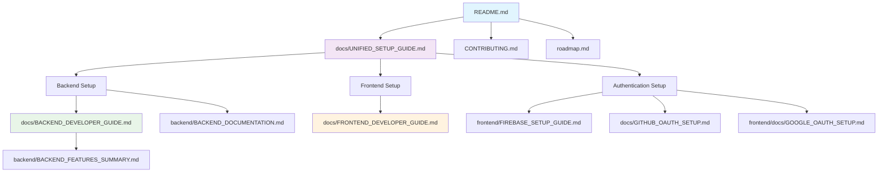

# Documentation Structure

This document shows the organization and relationship between all documentation files in the GenAI Misinformation Defense Platform repository.

## 📊 Documentation Hierarchy

```
📁 GenAI Repository
├── 📄 README.md                               [Main project overview]
├── 📄 CONTRIBUTING.md                         [How to contribute]
├── 📄 DEVELOPMENT_ROADMAP.md                  [Development timeline]
├── 📄 roadmap.md                              [Feature roadmap]
├── 📄 LICENSE                                 [Project license]
│
├── 📁 docs/                                   [Central documentation]
│   ├── 📄 UNIFIED_SETUP_GUIDE.md             [🔥 Primary setup guide]
│   ├── 📄 BACKEND_DEVELOPER_GUIDE.md         [Backend development reference]
│   ├── 📄 FRONTEND_DEVELOPER_GUIDE.md        [Frontend development reference]
│   ├── 📄 GITHUB_OAUTH_SETUP.md              [GitHub OAuth configuration]
│   ├── 📄 REDUNDANT_FILES.md                 [Files marked for removal]
│   └── 📄 tech-stack-implementation.md       [Technical implementation details]
│
├── 📁 backend/                                [Backend documentation]
│   ├── 📄 BACKEND_DOCUMENTATION.md           [Comprehensive API reference]
│   ├── 📄 BACKEND_FEATURES_SUMMARY.md        [Backend capabilities summary]
│   └── 📄 SETUP_GUIDE.md                     [⚠️ TO BE REMOVED]
│
├── 📁 frontend/                               [Frontend documentation]
│   ├── 📄 FIREBASE_SETUP_GUIDE.md            [Firebase configuration]
│   └── 📁 docs/
│       └── 📄 GOOGLE_OAUTH_SETUP.md          [Google OAuth configuration]
│
├── 📁 deployment/                             [Deployment documentation]
│   └── 📄 setup.sh                           [Deployment scripts]
│
└── 📄 SETUP_GUIDE_NEW.md                     [⚠️ TO BE REMOVED]
```

## 📋 Documentation Categories

### 🏠 Main Entry Points
- **`README.md`** - Main project overview, quick start, and navigation hub
- **`docs/UNIFIED_SETUP_GUIDE.md`** - Complete setup instructions for all components

### 👨‍💻 Developer Guides
- **`docs/BACKEND_DEVELOPER_GUIDE.md`** - Detailed backend development reference
- **`docs/FRONTEND_DEVELOPER_GUIDE.md`** - Detailed frontend development reference
- **`backend/BACKEND_DOCUMENTATION.md`** - Comprehensive API reference
- **`backend/BACKEND_FEATURES_SUMMARY.md`** - Quick backend features overview

### 🔐 Authentication & Configuration
- **`frontend/FIREBASE_SETUP_GUIDE.md`** - Firebase authentication setup
- **`docs/GITHUB_OAUTH_SETUP.md`** - GitHub OAuth integration
- **`frontend/docs/GOOGLE_OAUTH_SETUP.md`** - Google OAuth setup

### 🗺️ Project Planning
- **`CONTRIBUTING.md`** - Contribution guidelines
- **`roadmap.md`** - Feature roadmap
- **`DEVELOPMENT_ROADMAP.md`** - Development timeline

### 🚀 Deployment
- **`deployment/setup.sh`** - Deployment scripts and instructions

## 🎯 How to Navigate Documentation

### For New Developers
1. Start with **`README.md`** to understand the project
2. Follow **`docs/UNIFIED_SETUP_GUIDE.md`** for complete setup
3. Refer to specific developer guides as needed

### For Backend Developers
1. **`docs/UNIFIED_SETUP_GUIDE.md`** - Initial setup
2. **`docs/BACKEND_DEVELOPER_GUIDE.md`** - Development reference
3. **`backend/BACKEND_DOCUMENTATION.md`** - API details

### For Frontend Developers
1. **`docs/UNIFIED_SETUP_GUIDE.md`** - Initial setup
2. **`docs/FRONTEND_DEVELOPER_GUIDE.md`** - Development reference
3. **Firebase/OAuth guides** - Authentication setup

### For Authentication Setup
1. **`frontend/FIREBASE_SETUP_GUIDE.md`** - Firebase configuration
2. **`docs/GITHUB_OAUTH_SETUP.md`** - GitHub OAuth
3. **`frontend/docs/GOOGLE_OAUTH_SETUP.md`** - Google OAuth

### For Deployment
1. **`docs/UNIFIED_SETUP_GUIDE.md`** - Deployment section
2. **`deployment/setup.sh`** - Deployment scripts

## 📊 Documentation Flow Diagram



## 🔄 Document Relationships

### Primary Documents
- **README.md** → References all other documentation
- **UNIFIED_SETUP_GUIDE.md** → Central setup hub, references specific guides

### Specialized Guides
- **BACKEND_DEVELOPER_GUIDE.md** → References backend documentation
- **FRONTEND_DEVELOPER_GUIDE.md** → References authentication guides
- **BACKEND_DOCUMENTATION.md** → Standalone API reference

### Configuration Guides
- **FIREBASE_SETUP_GUIDE.md** → Referenced by unified setup and frontend guide
- **GITHUB_OAUTH_SETUP.md** → Referenced by unified setup
- **GOOGLE_OAUTH_SETUP.md** → Referenced by unified setup and frontend guide

## 🚮 Files Marked for Removal

The following files are redundant and will be removed:
- ⚠️ **`SETUP_GUIDE_NEW.md`** - Content moved to unified setup guide
- ⚠️ **`backend/SETUP_GUIDE.md`** - Content moved to unified setup and backend guides

## 🎯 Documentation Best Practices

### When Creating New Documentation
1. **Single Responsibility** - Each document should have a clear, specific purpose
2. **Cross-Reference** - Link to related documentation appropriately
3. **Update Hub Documents** - Update README.md and unified setup guide when adding new docs
4. **Consistent Structure** - Follow established patterns for headings and organization

### When Updating Documentation
1. **Check Dependencies** - Update any documents that reference the changed content
2. **Maintain Navigation** - Ensure links still work after changes
3. **Version Consistency** - Keep all references to versions and URLs current

## 📝 Quick Reference

| Need | Document |
|------|----------|
| Project overview | `README.md` |
| Complete setup | `docs/UNIFIED_SETUP_GUIDE.md` |
| Backend development | `docs/BACKEND_DEVELOPER_GUIDE.md` |
| Frontend development | `docs/FRONTEND_DEVELOPER_GUIDE.md` |
| API reference | `backend/BACKEND_DOCUMENTATION.md` |
| Firebase setup | `frontend/FIREBASE_SETUP_GUIDE.md` |
| OAuth setup | `docs/GITHUB_OAUTH_SETUP.md` or `frontend/docs/GOOGLE_OAUTH_SETUP.md` |
| Contributing | `CONTRIBUTING.md` |
| Feature roadmap | `roadmap.md` |

---

This structure provides clear navigation paths for different user types while maintaining comprehensive coverage of all aspects of the project.