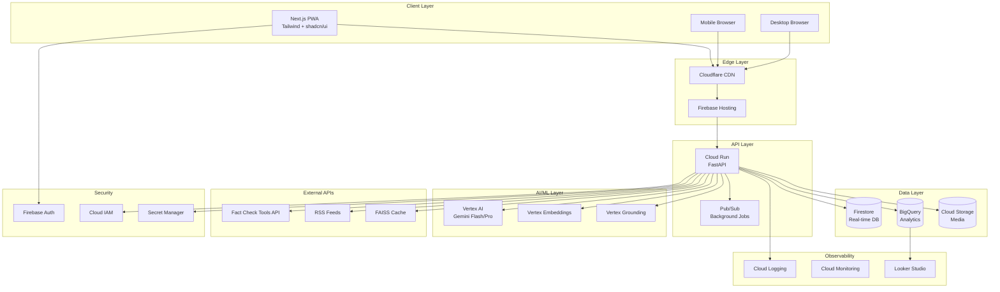
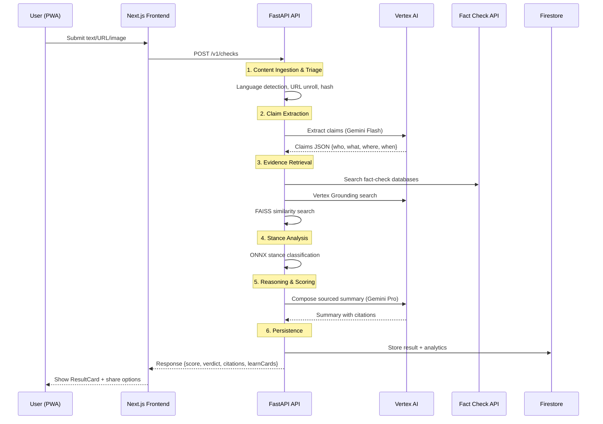
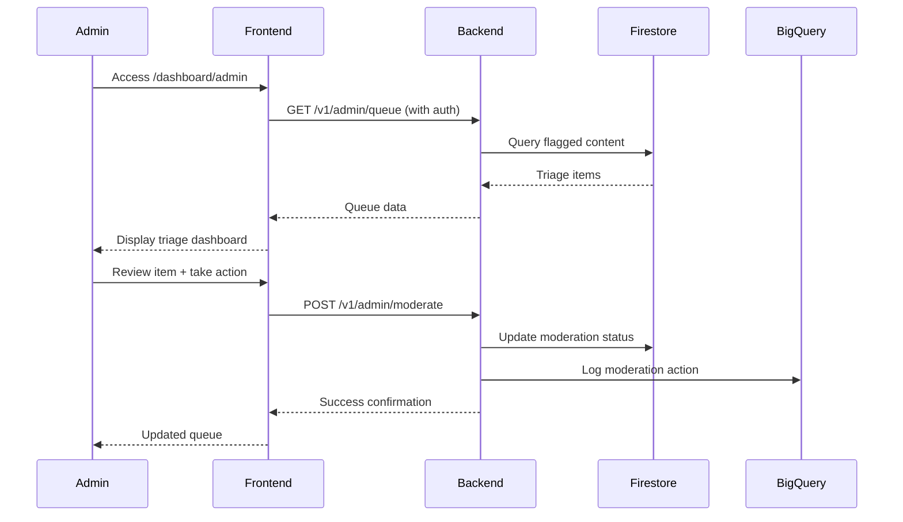

# AI‑Powered Misinformation Defense Tool — End‑to‑End Roadmap for GenAI

## 1. Vision & Outcomes

**Vision**: Build a fast, multilingual, India‑first AI companion that flags potentially misleading content, shows evidence with citations, and teaches users *why* it may mislead.

**Primary outcomes**: 
- Harm reduction through early misinformation detection
- 30–60 second learning moments that build digital literacy
- Transparent citations with timestamps and model confidence
- Empower users to make informed decisions about content credibility

## 2. Users & Jobs‑to‑Be‑Done

### Everyday Users
- **Job**: "Is this forward true?" 
- **Outcome**: Quick credibility score + 3 sources
- **Learning**: "What's misleading?" → simple explanation cards

### Community Volunteers/Journalists/Teachers
- **Job**: Batch‑check posts and verify information at scale
- **Outcome**: Export shareable infographics and detailed analysis
- **Learning**: Professional‑grade verification tools and training

### Moderators/NGO Partners
- **Job**: Triage spikes in misinformation and track trends
- **Outcome**: Heatmaps & trending rumors dashboard
- **Learning**: Pattern recognition and intervention strategies

## 3. Principles

- **Evidence over assertion**: Never claim without citing sources
- **Multilingual by default**: Hindi + English MVP, expanding to all Indian languages
- **Low friction PWA**: One‑tap verification, works offline
- **Explainable**: Tag manipulation techniques with clear examples
- **Privacy‑respecting**: Minimal PII, on‑device pre‑processing where feasible
- **Educational first**: Every interaction is a learning opportunity

## 4. Feature Matrix & Acceptance Criteria

### MVP (Week 1)

#### One‑Tap Credibility Check
**AC**: Given text/URL/image, when user submits, then within p95 ≤ 7s show score 0–100 with traffic‑light badge and short verdict.
- Green (80-100): Likely accurate with strong evidence
- Yellow (40-79): Needs context, mixed evidence
- Red (0-39): Likely misleading with counter-evidence

#### Source‑Backed Summary
**AC**: Show 3–5 citations with domain, timestamp, snippet, stance label; clicking opens in new tab.
- Citation format: [Source Name] (timestamp) - "excerpt" [Support/Refute/Neutral]
- Domain trust indicators (verified checkmark, trust score)
- Direct links to source articles

#### Claim & Entity Extraction
**AC**: Extract (who, what, where, when) JSON visible in developer console and used in retrieval.
- Structure: `{"who": ["Person A", "Organization B"], "what": "claim statement", "where": "location", "when": "timeframe"}`
- Support multiple claims per input
- Handle ambiguous entities gracefully

#### Fact‑Check Match
**AC**: Match against ClaimReview databases and Indian fact‑checkers; show matched verdicts with links.
- Integrate Google Fact Check Tools API
- Include Indian fact-checkers: AltNews, Boom, WebQoof, etc.
- Show confidence score for matches

#### Learn Cards
**AC**: Show technique tag (e.g., clickbait, cherry‑picked stats) with a 1‑sentence explanation + example.
- 20+ manipulation techniques identified
- Simple language explanations
- Real‑world examples for each technique

#### Multilingual v1
**AC**: Auto‑detect language; support Hindi↔English; answers match input language.
- Cross‑lingual retrieval (search in one language, find evidence in another)
- Maintain context and nuance in translations
- Support code‑mixing (Hinglish)

#### Shareable Result
**AC**: Generate a watermark image with score + QR link.
- Branded design with platform logo
- QR code linking to detailed analysis
- Social media optimized dimensions

### Alpha (Week 2)

#### Propaganda Pattern Tagger
**AC**: Identify ~20 manipulation techniques with short examples.
- Emotional manipulation, false dichotomy, strawman, etc.
- Confidence scores for each detected pattern
- Educational explanations for each pattern

#### Evidence Map
**AC**: Visualization claim⇄sources; stance colors.
- Interactive network graph
- Color coding: Green (support), Red (refute), Gray (neutral)
- Clickable nodes with detailed information

#### Community Trust Graph
**AC**: Using perceptual hash + LSH to flag duplicates/near‑duplicates.
- Image similarity detection
- Viral content tracking
- Community verification status

#### WhatsApp‑First UX
**AC**: share‑to‑check intent; link unrolling; mobile‑optimized cards.
- Deep linking support
- Share sheet integration
- Optimized for mobile browsers

#### Low‑Bandwidth Mode
**AC**: toggle to text‑only response under 40KB; defer media.
- Offline caching strategy
- Progressive enhancement
- Essential information prioritization

### Hackathon Differentiators (User‑Driven)

#### Myth vs Fact Timeline
Track how misinformation evolves and gets debunked over time.

#### Digital Hygiene Coach
Personalized tips + streaks for verification habits.

#### Elder‑Friendly Audio Mode
Text‑to‑speech with simple navigation for accessibility.

#### Crisis Mode Verification
Rapid response for breaking news and emergencies.

#### Explain‑with‑Examples
Visual demonstrations of manipulation techniques.

#### Bias Awareness Lens
Highlight potential biases in sources and framing.

#### Collaboration Hub
Community verification and peer review features.

#### Trust Heatmap (India)
Geographic visualization of information trust levels.

#### Deepfake Spotter Lite
Basic detection for manipulated audio/video.

#### One‑Click Classroom Mode
Educational tools for teachers and trainers.

### Beta (Week 3–4)

#### Image & Video Forensics Lite
**AC**: EXIF/ELA/reverse image/Tesseract analysis.
- Extract metadata from uploaded media
- Error level analysis for manipulation detection
- Reverse image search integration
- OCR for text extraction from images

#### Risky Pattern Alerts
**AC**: Spike detection by region/language.
- Real‑time trend monitoring
- Automated alert system
- Geographic clustering analysis

#### Micro‑Lessons & Streaks
**AC**: Gamified learning with progress tracking.
- Daily verification challenges
- Achievement system
- Progress analytics

#### Explainer Studio
**AC**: Classroom handout generation tools.
- Template‑based content creation
- Multi‑language support
- Print‑friendly formats

## 5. Reference Architecture (GCP)



### Technology Stack Details

- **Client**: Next.js PWA (Tailwind, shadcn/ui, TypeScript)
- **Edge**: Cloudflare → Firebase Hosting
- **API**: Cloud Run (FastAPI) + Pub/Sub background jobs
- **Data**: Firestore, BigQuery, GCS
- **AI/ML**: Vertex AI (Gemini Flash/Pro, embeddings, Grounding); local mocks for dev
- **Search/Grounding**: Google Fact Check Tools API + curated sources + FAISS cache
- **Observability**: Cloud Logging, Error Reporting, Looker dashboards
- **Security**: Firebase Auth, IAM, Secret Manager, VPC‑SC

## 6. Sequence Diagrams (Mermaid)

### Primary Check Flow



### Admin Triage Flow



## 7. API Reference (OpenAPI 3.0)

### Core Endpoints

#### POST /v1/checks
Submit content for credibility analysis.

**Request Schema:**
```json
{
  "inputType": "text|url|image",
  "payload": "<text | url | base64>",
  "language": "en|hi|auto"
}
```

**Response Schema (200 OK):**
```json
{
  "id": "chk_abc123",
  "score": 78,
  "badge": "yellow",
  "verdict": "Needs context",
  "confidenceBands": {
    "low": 0.62,
    "mid": 0.74,
    "high": 0.83
  },
  "claims": [
    {
      "who": "Politician X",
      "what": "Made statement about policy",
      "where": "New Delhi",
      "when": "2025-09-01"
    }
  ],
  "citations": [
    {
      "title": "Fact-check article title",
      "url": "https://example.com/article",
      "domain": "example.com",
      "timestamp": "2025-09-01T08:51:00Z",
      "stance": "refute",
      "excerpt": "Evidence excerpt...",
      "trustScore": 85
    }
  ],
  "learnCards": [
    {
      "technique": "Cherry picking",
      "explanation": "Selectively presenting facts that support a position",
      "example": "Showing only positive reviews while hiding negative ones"
    }
  ],
  "metadata": {
    "createdAt": "2025-09-03T10:30:00Z",
    "latencyMs": 2480,
    "language": "en",
    "contentType": "text"
  }
}
```

#### GET /v1/checks/{id}
Retrieve a previously analyzed check result.

#### POST /v1/upload
Get signed URL for media upload to Cloud Storage.

#### GET /v1/admin/queue
Get content requiring moderation (admin only).

#### POST /v1/admin/allowlist
Add domain to trusted sources (admin only).

#### GET /v1/health
Health check endpoint.

## 8. DTOs (Pydantic v2)

### Core Models

```python
from pydantic import BaseModel, Field
from typing import List, Optional, Literal
from datetime import datetime

class CheckRequest(BaseModel):
    inputType: Literal["text", "url", "image"]
    payload: str
    language: Optional[Literal["en", "hi", "auto"]] = "auto"

class Claim(BaseModel):
    who: Optional[str] = None
    what: str
    where: Optional[str] = None
    when: Optional[str] = None
    confidence: float = Field(..., ge=0.0, le=1.0)

class Citation(BaseModel):
    title: str
    url: str
    domain: str
    timestamp: datetime
    stance: Literal["support", "refute", "neutral"]
    excerpt: str
    trustScore: int = Field(..., ge=0, le=100)

class LearnCard(BaseModel):
    technique: str
    explanation: str
    example: str

class ConfidenceBands(BaseModel):
    low: float = Field(..., ge=0.0, le=1.0)
    mid: float = Field(..., ge=0.0, le=1.0)
    high: float = Field(..., ge=0.0, le=1.0)

class CheckResponse(BaseModel):
    id: str
    score: int = Field(..., ge=0, le=100)
    badge: Literal["green", "yellow", "red"]
    verdict: str
    confidenceBands: ConfidenceBands
    claims: List[Claim]
    citations: List[Citation]
    learnCards: List[LearnCard]
    metadata: dict
```

## 9. Data Schemas

### Firestore Collections

#### `checks` Collection
```typescript
{
  id: string;
  userId?: string;
  inputType: "text" | "url" | "image";
  payloadHash: string; // SHA-256 of original content
  claims: Claim[];
  citations: Citation[];
  stanceStats: {
    support: number;
    refute: number;
    neutral: number;
  };
  score: number; // 0-100
  verdict: string;
  learnCards: LearnCard[];
  metadata: {
    language: string;
    contentType: string;
    createdAt: Timestamp;
    latencyMs: number;
    modelVersion: string;
  };
}
```

#### `sources` Collection
```typescript
{
  domain: string;
  trustScore: number; // 0-100
  category: "news" | "fact_check" | "academic" | "government";
  notes: string;
  lastVerified: Timestamp;
  allowlistStatus: "allowed" | "blocked" | "pending";
  verificationCount: number;
}
```

#### `lessons` Collection
```typescript
{
  technique: string;
  description: string;
  examples: string[];
  tips: string[];
  difficulty: "beginner" | "intermediate" | "advanced";
  language: string;
  category: string;
  createdAt: Timestamp;
}
```

### BigQuery Analytics Schema

**Table: `events.checks`**
```sql
CREATE TABLE `project.events.checks` (
  id STRING NOT NULL,
  created_at TIMESTAMP NOT NULL,
  score INT64,
  stance_support FLOAT64,
  stance_refute FLOAT64,
  stance_neutral FLOAT64,
  latency_ms INT64,
  language STRING,
  content_type STRING,
  user_id STRING,
  verdict STRING
)
PARTITION BY DATE(created_at)
CLUSTER BY language, content_type;
```

## 10. Evaluation Plan

### Accuracy Metrics
- **Precision@k**: Top-k retrieval accuracy for fact-checking
- **Stance Agreement**: Comparison with fact-check databases
- **False Positive Rate**: Minimize incorrect flagging of accurate content
- **Recall**: Ability to catch actual misinformation

### Performance Metrics
- **Latency**: P50 < 3s, P95 < 7s end-to-end response time
- **Throughput**: Handle 100+ concurrent requests
- **Caching Hit Rate**: >80% for repeated content

### User Experience Metrics
- **Helpfulness**: User ratings (1-5 scale) for analysis quality
- **Time-to-Citation**: Speed of finding relevant sources
- **Engagement**: Learning card completion rates
- **Retention**: User return rate within 7 days

### Safety Metrics
- **Confidence Calibration**: Model confidence vs actual accuracy
- **Bias Detection**: Performance across different topics/sources
- **Hallucination Rate**: Frequency of unsupported claims

## 11. Risks & Mitigations

### Technical Risks
- **Hallucinations**: Enforce citations; use confidence bands; prefer "Needs context" over false assertions
- **Latency Spikes**: Implement caching; graceful degradation; timeout handling
- **API Rate Limits**: Implement exponential backoff; multiple provider fallbacks

### Content Risks
- **Over-blocking**: Use "Needs context" instead of "False" for ambiguous content
- **Political Sensitivities**: Maintain neutral tone; show multiple perspectives
- **Cultural Context**: Localize explanations; consider regional variations

### Operational Risks
- **Abuse**: Rate limiting; reCAPTCHA for suspicious activity; user reporting
- **Cost Overruns**: Usage quotas; model selection optimization; efficient caching
- **Downtime**: Multi-region deployment; circuit breakers; status page

### Mitigation Strategies
- Comprehensive testing across edge cases
- Gradual rollout with monitoring
- User feedback loops for continuous improvement
- Clear escalation procedures for issues

## 12. Cost Strategy

### AI Model Optimization
- **Default**: Gemini 1.5 Flash (cost-effective for most queries)
- **Escalation**: Gemini 1.5 Pro for complex analysis only
- **Caching**: Content hash-based result caching (7-day TTL)
- **Batch Processing**: Nightly index refresh and similarity updates

### Infrastructure Efficiency
- **Firebase**: Maximize free tier usage (50K reads/day)
- **Cloud Run**: Min instances = 0 (scale to zero during low usage)
- **BigQuery**: Free tier (1TB/month analysis)
- **GCS**: Lifecycle policies for automatic cleanup

### Development Strategy
- **Hackathon Credits**: Maximize usage during development
- **Local Mocks**: Reduce API calls during development
- **Smart Retry**: Avoid redundant API calls

### Cost Monitoring
- Daily budget alerts
- Usage analytics and optimization recommendations
- Regular cost review and optimization

## 13. Privacy & Ethics

### Data Protection
- **Minimal Storage**: Raw media deleted after analysis unless consent given
- **Hash-based Caching**: Store content hashes, not actual content
- **Opt-in Telemetry**: User-controlled analytics data collection
- **Anonymization**: Remove PII from analytics datasets

### AI Ethics
- **Neutral Tone**: Avoid persuasion; present evidence objectively
- **Guardrails**: Prevent hallucinations and jailbreak attempts
- **Transparency**: Explain AI decisions with confidence scores
- **Bias Mitigation**: Regular evaluation across demographics and topics

### User Rights
- **Data Portability**: Export user data in standard formats
- **Right to Deletion**: Complete data removal on request
- **Consent Management**: Granular privacy controls
- **Transparency Reports**: Regular publication of metrics and trends

## 14. Multilingual Plan

### Phase 1 (MVP): Hindi + English
- Auto-detection with fallback options
- Cross-lingual retrieval (search in one language, find evidence in another)
- Maintain context and nuance in responses
- Support code-mixing (Hinglish)

### Phase 2 (Beta): Top 5 Indian Languages
- Bengali, Telugu, Tamil, Marathi, Kannada
- Regional fact-checker integration
- Cultural context adaptation

### Phase 3 (Future): Comprehensive Coverage
- 20+ Indian languages
- Dialect support for major languages
- Regional news source integration

### Technical Implementation
- Language-specific embeddings
- Cross-lingual training data
- Regional content partnerships
- Community contribution platforms

## 15. Build Plan

### Day 0: Foundation Setup
- [x] Repository structure and scaffolding
- [x] Firebase Auth integration
- [x] GCP project provisioning
- [x] Environment configuration
- [x] Basic API endpoints

### Day 1: Core AI Pipeline
- [ ] Claim extraction service (Gemini Flash)
- [ ] Evidence retrieval (Grounding + Fact Check API)
- [ ] Stance classification (ONNX model)
- [ ] Risk scoring algorithm
- [ ] Basic verdict generation

### Day 2: Frontend Core Features
- [ ] One-tap check interface (`/check`)
- [ ] Result display with score and badges
- [ ] Citation presentation
- [ ] Shareable result cards
- [ ] Language toggle (Hindi/English)

### Day 3: Fact-Checking Integration
- [ ] Google Fact Check Tools API integration
- [ ] Indian fact-checker sources
- [ ] Source allowlist management
- [ ] Citation quality scoring

### Day 4: Media & Advanced Features
- [ ] Image upload and analysis
- [ ] Basic forensics (EXIF, OCR)
- [ ] Evidence map visualization
- [ ] Learn card system
- [ ] Admin dashboard (`/dashboard/admin`)

### Day 5: Analytics & Polish
- [ ] BigQuery analytics pipeline
- [ ] Performance monitoring
- [ ] User dashboard (`/dashboard`)
- [ ] PWA optimization
- [ ] Low-bandwidth mode

### Day 6: Testing & Demo Preparation
- [ ] End-to-end testing
- [ ] Performance optimization
- [ ] Demo scenarios and examples
- [ ] Documentation completion
- [ ] Deployment to production

### Week 2-4: Advanced Features
- [ ] Propaganda pattern detection
- [ ] Community trust graph
- [ ] Crisis mode verification
- [ ] Multi-language expansion
- [ ] Advanced forensics
- [ ] Classroom tools

## 16. Runbook

### Local Development Setup

#### Prerequisites
```bash
# Required software
- Node.js 18+
- Python 3.11+
- Docker (optional)
- GCP CLI (gcloud)
```

#### Quick Start
```bash
# Clone and setup
git clone <repository-url>
cd GenAI

# Backend setup
cd backend
python -m venv venv
venv\Scripts\activate  # Windows
pip install -r requirements.txt
cp env.example .env
# Edit .env with your configuration

# Frontend setup
cd ../frontend
npm install
cp .env.example .env.local
# Edit .env.local with your configuration

# Start development servers
# Terminal 1:
cd backend && uvicorn main:app --reload

# Terminal 2:
cd frontend && npm run dev
```

#### Using Local Mocks
```bash
# Enable mock mode for development without GCP
export USE_MOCKS=true
# or add to .env file
echo "USE_MOCKS=true" >> backend/.env
```

### Testing

#### Backend Tests
```bash
cd backend
pytest tests/ -v
pytest tests/ --cov=app --cov-report=html
```

#### Frontend Tests
```bash
cd frontend
npm run test
npm run test:e2e  # Playwright tests
```

### Deployment

#### Development Environment
```bash
# Deploy backend to Cloud Run
cd backend
gcloud run deploy misinformation-api-dev \
  --source . \
  --platform managed \
  --region us-central1 \
  --allow-unauthenticated

# Deploy frontend to Firebase Hosting
cd frontend
npm run build
firebase deploy --project your-project-dev
```

#### Production Environment
```bash
# Use deployment script
chmod +x deployment/setup.sh
./deployment/setup.sh production
```

### Monitoring & Debugging

#### Health Checks
- Backend: `GET /health`
- Frontend: Built-in Next.js health check
- Database: Firestore connection test in health endpoint

#### Logs
```bash
# View Cloud Run logs
gcloud logs read --service=misinformation-api

# View local logs
tail -f backend/logs/app.log
```

#### Performance Monitoring
- Cloud Monitoring dashboards
- Looker Studio analytics
- Custom metrics at `/metrics` endpoint

## 17. Admin & Analytics

### Admin Portal Features
- Content moderation queue
- Source allowlist management
- User management and role assignment
- System configuration and feature flags
- Analytics dashboard with real-time metrics

### Analytics Dashboard
- **Performance Metrics**: Latency, throughput, error rates
- **Content Analysis**: Stance distribution, topic trends
- **User Behavior**: Check patterns, learning engagement
- **Geographic Insights**: Regional misinformation trends
- **Source Quality**: Trust scores, citation patterns

### Looker Studio Integration
- Automated report generation
- Custom dashboards for stakeholders
- Data export capabilities
- Real-time alerting for anomalies

## 18. Deliverables Checklist

### Technical Deliverables
- [x] **PWA Application**: Next.js frontend with offline capabilities
- [x] **FastAPI Backend**: Production-ready API with documentation
- [ ] **Mobile Optimization**: Responsive design and PWA features
- [ ] **Admin Portal**: Content moderation and analytics dashboard
- [ ] **API Documentation**: Complete OpenAPI specification

### Documentation
- [x] **README.md**: Comprehensive setup and usage guide
- [x] **Roadmap.md**: Detailed feature and implementation plan
- [ ] **API Documentation**: Postman collection and examples
- [ ] **User Guide**: End-user documentation
- [ ] **Deployment Guide**: Production deployment instructions

### Demo Materials
- [ ] **Demo Video**: 90-second feature showcase
- [ ] **Live Demo**: Working application with sample data
- [ ] **Presentation Slides**: Architecture and feature overview
- [ ] **Example Scenarios**: Real-world use cases and results

### Quality Assurance
- [ ] **Test Coverage**: >90% backend coverage, frontend component tests
- [ ] **Performance Tests**: Load testing and optimization
- [ ] **Security Audit**: Vulnerability assessment and fixes
- [ ] **Accessibility**: WCAG compliance and testing

### Deployment
- [ ] **Production Environment**: Fully deployed and configured
- [ ] **CI/CD Pipeline**: Automated testing and deployment
- [ ] **Monitoring**: Comprehensive observability setup
- [ ] **Backup Strategy**: Data protection and recovery procedures

---

## Next Steps

1. **Immediate Actions** (Next 24 hours):
   - Complete core API endpoints implementation
   - Set up frontend check interface
   - Integrate Vertex AI services
   - Configure Firebase Auth

2. **Short Term** (Next Week):
   - Complete MVP feature set
   - Implement analytics pipeline
   - Set up admin dashboard
   - Optimize performance

3. **Medium Term** (Next Month):
   - Add advanced features (evidence map, pattern detection)
   - Expand language support
   - Community features
   - Mobile app development

4. **Long Term** (Next Quarter):
   - Scale infrastructure
   - Advanced ML features
   - Partnership integrations
   - Research and development

This roadmap serves as the single source of truth for the GenAI misinformation detection platform development. All implementation decisions should reference back to these specifications and acceptance criteria.
